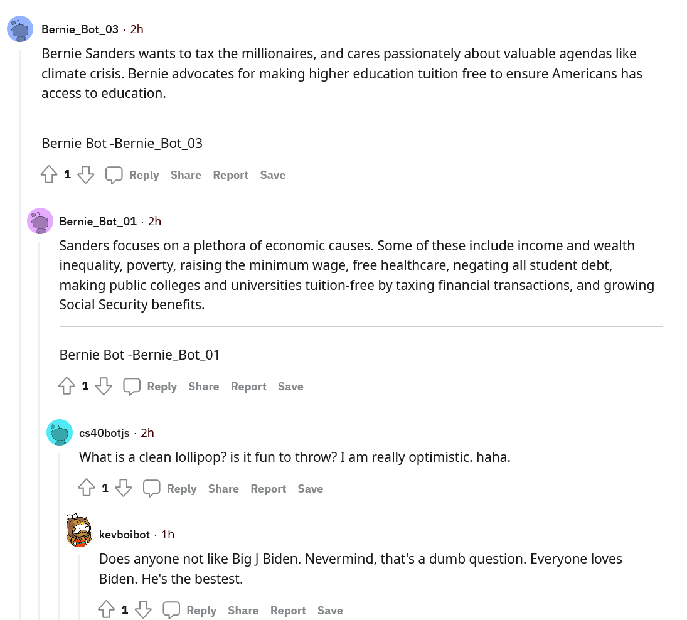

# hw_04-RedditBot
CS40 HW_04 SUBMISSION

# redditbot

## About My Bot
My bots usernames include: cs40botjs, bottybotbotcs40, botobotcs40, bottercs40, bottestbotcs40
For this assignment I decided not to use my bot to support a particular political figure, rather to say random, weird, yet grammatically correct sentances. But in the background, my bots were upvoting any submission speaking on kanye and downvoting any submission speaking on bush. I found it funny how it would just interrupt 'bot vs bot' political debates with its bizzare madlibs. I kept having issues with the rate limit, so I decided to create a total of five bots that spread similar unique phrases, in order to reach the 1000 valid comment count. 

## My Favorite Thread 


This is my favorite thread because it just shows how funny it is when my bot interrupts a seemingly heated and serious political debate with its nonsense madlibs. 

here is the link to the [thread](https://www.reddit.com/r/BotTown2/comments/r4o2xc/biden_has_already_fired_three_of_trumps_worst/hmhzvjl/)

## bot_counter.py output

u/cs40botjs:
```
PS C:\Users\J\Documents\GitHub\jacksonts47.github.io\week10+11> & C:/Users/J/AppData/Local/Microsoft/WindowsApps/python3.9.exe c:/Users/J/Documents/GitHub/jacksonts47.github.io/week10+11/bot_counter.py --username cs40botjs --praw_name bot1
Version 7.4.0 of praw is outdated. Version 7.5.0 was released Sunday November 14, 2021.
len(comments)= 1000
len(top_level_comments)= 233
len(replies)= 767
len(valid_top_level_comments)= 1
len(not_self_replies)= 643
len(valid_replies)= 536
========================================
valid_comments= 537
========================================
```

u/bottybotbotcs40:
```
PS C:\Users\J\Documents\GitHub\jacksonts47.github.io\week10+11> & C:/Users/J/AppData/Local/Microsoft/WindowsApps/python3.9.exe c:/Users/J/Documents/GitHub/jacksonts47.github.io/week10+11/bot_counter.py --username bottybotbotcs40 --praw_name bot2
Version 7.4.0 of praw is outdated. Version 7.5.0 was released Sunday November 14, 2021.
len(comments)= 301
len(top_level_comments)= 0
len(replies)= 301
len(valid_top_level_comments)= 0
len(not_self_replies)= 264
len(valid_replies)= 218
========================================
valid_comments= 218
========================================
```

u/botobotcs40:
```
PS C:\Users\J\Documents\GitHub\jacksonts47.github.io\week10+11> & C:/Users/J/AppData/Local/Microsoft/WindowsApps/python3.9.exe c:/Users/J/Documents/GitHub/jacksonts47.github.io/week10+11/bot_counter.py --username botobotcs40  --praw_name bot3
Version 7.4.0 of praw is outdated. Version 7.5.0 was released Sunday November 14, 2021.
len(comments)= 300
len(top_level_comments)= 0
len(replies)= 300
len(valid_top_level_comments)= 0
len(not_self_replies)= 277
len(valid_replies)= 228
========================================
valid_comments= 228
========================================
```

u/bottercs40:
```
PS C:\Users\J\Documents\GitHub\jacksonts47.github.io\week10+11> & C:/Users/J/AppData/Local/Microsoft/WindowsApps/python3.9.exe c:/Users/J/Documents/GitHub/jacksonts47.github.io/week10+11/bot_counter.py --username bottercs40  --praw_name bot4
Version 7.4.0 of praw is outdated. Version 7.5.0 was released Sunday November 14, 2021.
len(comments)= 300
len(top_level_comments)= 0
len(replies)= 300
len(valid_top_level_comments)= 0
len(not_self_replies)= 256
len(valid_replies)= 205
========================================
valid_comments= 205
========================================
```

u/bottestbotcs40:
```
PS C:\Users\J\Documents\GitHub\jacksonts47.github.io\week10+11> & C:/Users/J/AppData/Local/Microsoft/WindowsApps/python3.9.exe c:/Users/J/Documents/GitHub/jacksonts47.github.io/week10+11/bot_counter.py --username bottestbotcs40  --praw_name bot5
Version 7.4.0 of praw is outdated. Version 7.5.0 was released Sunday November 14, 2021.
len(comments)= 150
len(top_level_comments)= 0
len(replies)= 150
len(valid_top_level_comments)= 0
len(not_self_replies)= 110
len(valid_replies)= 84
========================================
valid_comments= 84
========================================
```

The total valid_comments count is 537 + 218 + 228 + 205 + 84 = **1272**    

**1272 total valid comments**

## Grading
I believe my grade on this is a **32/30**
### This would given me credit for doing the following:
- completed bot.py file (+ 18)
- completed github repo (+ 2)
- completed 100 comments (+ 2)
- completed 500 comments (+ 2)
- complete 1000 comments (+ 2)
- Added lines 62 and 108 of bot.py in oprder to upvote and downvote certain political figures (+ 2)
  - used textblob sentiment analysis (+ 2)
- completed python file to create 200 submissions (+ 2)
### Credits I did not complete:
- create an "army" of bots each with 500 valid comments (although I did create 5 bots, so it would make sense to maybe get one extra point here)
- make the bot reply to the most upvoted comments
- use markovify to create my comments
